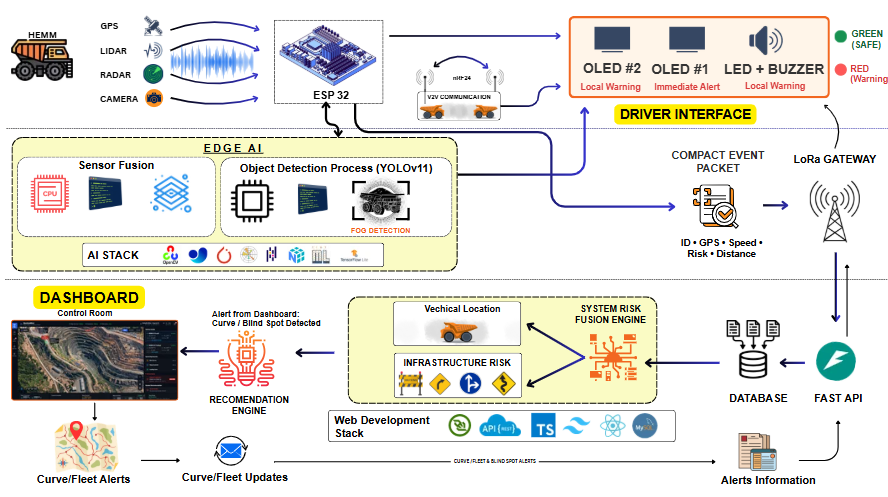
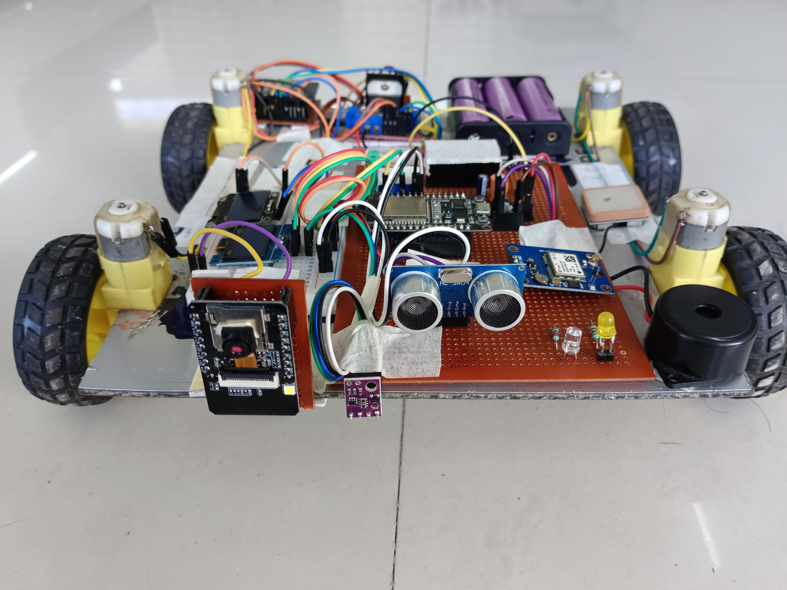
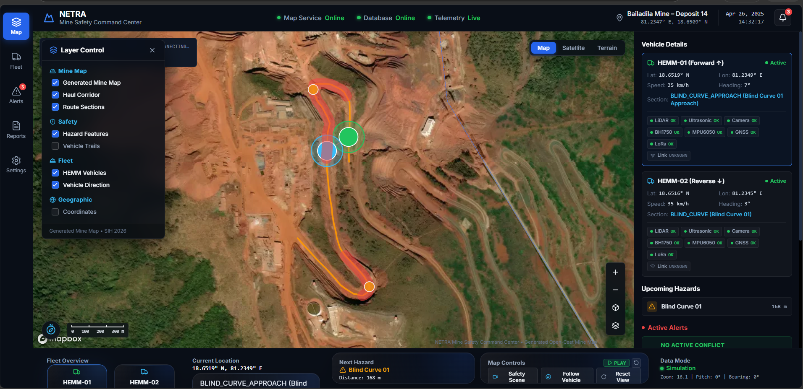

<div align="center">

# 🚜 NETRA

### Intelligent Safety Infrastructure for Open-Cast Mining

**Edge-first haul-road safety · V2V hazard awareness · Real-time fleet monitoring**

<br>

[](https://sih-2026-netra.vercel.app/#/command-center)
[](https://github.com/TVYOM/SIH-2026-NETRA)

<br>


</div>

---

## 🚨 The Problem

Open-cast mining haul roads operate with large HEMM vehicles in environments where **visibility, reaction time and communication can become critical safety factors**.

Typical challenges include:

* 🌫️ Dense fog and severely reduced visibility
* 🛣️ Blind curves and restricted line-of-sight
* 🚛 Multiple heavy vehicles sharing narrow haul roads
* 📡 Intermittent communication in mining environments
* ⚠️ Unexpected obstacles and proximity hazards
* ⏱️ Limited reaction time during critical situations

A purely centralized safety system can introduce another dependency:

```text
Vehicle
   ↓
Network
   ↓
Server
   ↓
Decision
   ↓
Driver
```

If connectivity is unavailable or delayed, the warning path can be affected.

---

# 💡 The NETRA Approach

**NETRA** is a multi-layer safety-assistance prototype designed around one core principle:

> **Critical vehicle-side awareness should happen as close to the vehicle as possible.**

NETRA combines:

```text
        ┌──────────────────────┐
        │      VEHICLE         │
        │ Sensors + GPS + ESP32│
        └──────────┬───────────┘
                   │
                   ▼
          ┌─────────────────┐
          │  EDGE SAFETY    │
          │  RISK ASSESSMENT│
          └────────┬────────┘
                   │
        ┌──────────┼──────────┐
        ▼          ▼          ▼
     DRIVER       V2V       TELEMETRY
     ALERT      AWARENESS       │
        │          │            ▼
        │          │      FASTAPI BACKEND
        │          │            │
        │          │       WebSocket
        │          │            │
        ▼          ▼            ▼
       VEHICLE ◄────────► COMMAND CENTER
```

### NETRA connects three safety layers:

| Layer                  | Purpose                                        |
| ---------------------- | ---------------------------------------------- |
| 🚛 **Vehicle Layer**   | Sense and respond locally                      |
| 📡 **V2V Layer**       | Share hazard awareness between nearby vehicles |
| 🖥️ **Command Center** | Give operators a real-time fleet view          |

---

# ⚡ Why NETRA?

The system separates **immediate vehicle safety** from **centralized monitoring**.

### Conventional centralized approach

```text
Vehicle → Network → Server → Decision → Driver
```

### NETRA approach

```text
Vehicle → Edge Decision → Driver Alert
              │
              ├────► V2V Hazard Awareness
              │
              └────► Command Center Telemetry
```

This means the command center complements the vehicle rather than becoming the only source of safety awareness.

---

# 🎯 Problem → NETRA Response

| Mining Challenge                | NETRA Response                            |
| ------------------------------- | ----------------------------------------- |
| 🌫️ Dense fog                   | Visibility-aware safety context           |
| 🛣️ Blind curves                | V2V-based hazard awareness                |
| 🚛 Heavy vehicle traffic        | Vehicle telemetry and proximity awareness |
| 📡 Connectivity gaps            | Local vehicle-side safety logic           |
| ⏱️ Short reaction time          | Local driver alerts                       |
| 🖥️ Limited operator visibility | Real-time command center                  |

---

# 🏗️ System Architecture



### Architecture Overview

```text
┌─────────────────────────────────────────────┐
│               VEHICLE / HEMM               │
│                                             │
│     Sensors + GPS + ESP32 Edge Controller   │
└──────────────────────┬──────────────────────┘
                       │
             ┌─────────┴─────────┐
             │                   │
             ▼                   ▼
      LOCAL SAFETY            V2V LINK
          LOGIC                nRF24
             │                   │
             ▼                   ▼
       OLED / LED /        Nearby Vehicles
          BUZZER              │
             │                │
             └───────┬────────┘
                     ▼
                TELEMETRY
                     │
              LoRa / Wi-Fi
                     │
                     ▼
             ┌───────────────┐
             │    FastAPI    │
             │    Backend    │
             └───────┬───────┘
                     │
             ┌───────┴────────┐
             ▼                ▼
         Database         WebSocket
                              │
                              ▼
                  ┌────────────────────┐
                  │  React Command     │
                  │      Center        │
                  └────────────────────┘
```

### System Layers

| Layer                        | Technology / Role                  |
| ---------------------------- | ---------------------------------- |
| **Vehicle**                  | Sensors, GPS and prototype vehicle |
| **Edge**                     | ESP32 local processing             |
| **V2V**                      | nRF24L01 communication             |
| **Long-range communication** | LoRa                               |
| **Backend**                  | FastAPI + SQLAlchemy               |
| **Real-time layer**          | WebSocket                          |
| **Frontend**                 | React + TypeScript + Vite          |
| **ML**                       | Keras / INT8 TFLite prototype      |

---

# 🔄 NETRA Safety Pipeline

```text
Sensor Data
     ↓
Preprocessing
     ↓
Context / Sensor Fusion
     ↓
Risk Assessment
     ↓
Safety State
     ↓
┌───────────┬──────────────┬─────────────────┐
│           │              │                 │
▼           ▼              ▼                 ▼
SAFE     CAUTION        HAZARD          TELEMETRY
│           │              │                 │
▼           ▼              ▼                 ▼
OLED       LED          Buzzer         Command Center
```

NETRA uses a simple shared safety vocabulary:

| State          | Meaning                                                 | Response                |
| -------------- | ------------------------------------------------------- | ----------------------- |
| 🟢 **SAFE**    | Normal operating conditions                             | Normal monitoring       |
| 🟡 **CAUTION** | Reduced visibility / approaching risk / stale telemetry | Driver warning          |
| 🔴 **HAZARD**  | Critical proximity or high-risk condition               | Immediate local warning |

> Thresholds are configurable and require mine-specific field validation before any real-world deployment.

---

# 🌀 Blind-Curve Safety

A blind curve creates a unique problem:

**The absence of a visible obstacle does not mean the road is safe.**

Two vehicles can approach each other from opposite directions while remaining outside each other's line of sight.

```text
                  BLIND CURVE
                       ╲
                        ╲
 Vehicle A ──────────────╲
                          ╲
                           ╲
                            ╲──────── Vehicle B
```

NETRA uses vehicle position and safety-state information to provide an additional layer of awareness around such situations.

### Safety flow

```text
Vehicle A approaches curve
            ↓
Vehicle B approaches from opposite side
            ↓
V2V exchanges vehicle awareness
            ↓
Risk context increases
            ↓
Local driver warning
            ↓
Command Center receives telemetry
```

This allows NETRA to address a situation where a simple forward-facing distance sensor may not have direct line-of-sight to the approaching vehicle.

---

# 📡 V2V Communication

NETRA uses a local V2V communication layer for prototype vehicle-to-vehicle awareness.

```text
┌────────────┐
│ Vehicle A  │
└─────┬──────┘
      │
      │ Position
      │ Safety State
      │ Hazard Information
      ▼
┌────────────┐
│  nRF24L01  │
└─────┬──────┘
      │
      ▼
┌────────────┐
│ Vehicle B  │
└─────┬──────┘
      │
      ▼
 Local Warning
```

### Communication roles

| Communication        | Purpose                     |
| -------------------- | --------------------------- |
| **nRF24L01**         | Local V2V hazard awareness  |
| **LoRa**             | Long-range telemetry path   |
| **Wi-Fi / Internet** | Backend connectivity        |
| **WebSocket**        | Real-time dashboard updates |

V2V is designed as a local communication path and does not require the command center for the vehicle-to-vehicle warning path.

---

# 🌐 Network-Aware Design

Mining environments can have unreliable connectivity.

NETRA therefore separates:

### Local safety

```text
Vehicle
   ↓
ESP32
   ↓
Risk Assessment
   ↓
Driver Alert
```

### Central monitoring

```text
Vehicle
   ↓
Communication
   ↓
FastAPI
   ↓
WebSocket
   ↓
Command Center
```

The local vehicle warning does not depend on a server round-trip.

The command center, however, requires telemetry connectivity.

> NETRA does not claim completely offline fleet monitoring. The offline-independent component is the vehicle-side warning path.

---

# 🔧 Hardware Prototype

## Front View

<p align="center">

</p>

## Top View

<p align="center">

</p>

### Prototype Components

| Component             | Role                                       |
| --------------------- | ------------------------------------------ |
| **ESP32**             | Edge controller and wireless communication |
| **GPS Module**        | Vehicle positioning                        |
| **nRF24L01**          | Local V2V communication                    |
| **LoRa Module**       | Long-range communication                   |
| **LiDAR / ToF**       | Proximity sensing                          |
| **Ultrasonic Sensor** | Short-range distance sensing               |
| **OLED**              | Driver information                         |
| **RGB LEDs**          | Safety-state indication                    |
| **Buzzer**            | Audible warning                            |
| **Motor Driver**      | Vehicle movement control                   |
| **DC Motors**         | Prototype vehicle movement                 |

### Firmware

```text
hardware/
└── esp32_hemm_telemetry/
    └── esp32_hemm_telemetry.ino
```

---

# 🧠 Edge AI / TinyML

NETRA also contains a TinyML model pipeline designed to move ML inference closer to the embedded system.

```text
TinyML3.py
     ↓
Keras Model
     ↓
INT8 Quantization
     ↓
TFLite Model
     ↓
Embedded C Model
     ↓
ESP32
```

### Model artifacts

| Artifact                | Status                      |
| ----------------------- | --------------------------- |
| `TinyML3.py`            | ✅ Present                   |
| `.keras` model          | ✅ Present                   |
| INT8 `.tflite` model    | ✅ Present                   |
| Embedded C model array  | ✅ Present                   |
| Preprocessing header    | ✅ Present                   |
| ESP32 live inference    | 🧪 Prototype / experimental |
| Camera / YOLO detection | ✅ Present                |

No unsupported model accuracy, latency or field-performance numbers are claimed.

---

# 🖥️ Live Command Center

<p align="center">

</p>

## 🚀 [Open the Live NETRA Command Center](https://sih-2026-netra.vercel.app/#/command-center)

The command center provides an operator-facing view of the mining environment.

### Dashboard capabilities

| Module           | Purpose                          |
| ---------------- | -------------------------------- |
| 🗺️ **Map**      | Mine and haul-road visualization |
| 🚛 **Vehicles**  | Vehicle positions and telemetry  |
| ⚠️ **Alerts**    | Active safety events             |
| 🔴 **Risk**      | Safety-state monitoring          |
| 🚨 **Incidents** | Incident information             |
| 📡 **Network**   | Communication status             |
| 📊 **Analytics** | Operational overview             |

---

# 🎬 NETRA Demonstration Flow

The complete safety story can be demonstrated as:

```text
NORMAL ROAD
     ↓
LOW VISIBILITY
     ↓
BLIND CURVE
     ↓
ONCOMING VEHICLE
     ↓
RISK DETECTED
     ↓
LOCAL DRIVER ALERT
     ↓
V2V WARNING
     ↓
COMMAND CENTER UPDATE
```

### The key idea

One event is represented across multiple layers:

```text
             HAZARD
                │
      ┌─────────┼─────────┐
      ▼         ▼         ▼
   DRIVER      V2V     OPERATOR
   ALERT      WARNING   AWARENESS
```

This creates a connection between **vehicle-level safety** and **fleet-level situational awareness**.

---

# 🛠️ Technology Stack

| Layer                        | Technologies                      |
| ---------------------------- | --------------------------------- |
| **Frontend**                 | React · TypeScript · Vite         |
| **Maps / Visualization**     | Map-based real-time visualization |
| **Backend**                  | Python · FastAPI                  |
| **Database**                 | SQLAlchemy · Alembic              |
| **Real-time**                | WebSocket                         |
| **Embedded**                 | ESP32 · C/C++                     |
| **V2V**                      | nRF24L01                          |
| **Long-range communication** | LoRa                              |
| **ML**                       | Keras · TensorFlow Lite INT8      |
| **Hosting**                  | Vercel                            |

---

# 🧩 Software Architecture

```text
                 ESP32 / VEHICLE
                       │
                       │ Telemetry
                       ▼
                ┌─────────────┐
                │   FastAPI   │
                │   Backend   │
                └──────┬──────┘
                       │
              ┌────────┴────────┐
              ▼                 ▼
          Database          WebSocket
                                │
                                ▼
                       React Command Center
                                │
                  ┌─────────────┼─────────────┐
                  ▼             ▼             ▼
                Map           Alerts       Analytics
```

### Backend

```text
backend/
├── app/
│   ├── api/
│   ├── constants/
│   ├── core/
│   ├── database/
│   ├── schemas/
│   ├── services/
│   └── websocket/
├── migrations/
├── scripts/
├── tests/
└── requirements.txt
```

### Frontend

```text
frontend/
├── public/
└── src/
    ├── components/
    ├── contexts/
    ├── data/
    ├── hooks/
    ├── map/
    ├── pages/
    ├── services/
    ├── styles/
    ├── types/
    └── utils/
```

---

# 📁 Repository Structure

```text
SIH-2026-NETRA/
│
├── backend/
│   ├── app/
│   ├── migrations/
│   ├── scripts/
│   ├── tests/
│   ├── requirements.txt
│   └── README.md
│
├── frontend/
│   ├── public/
│   ├── src/
│   ├── package.json
│   └── vite.config.ts
│
├── hardware/
│   └── esp32_hemm_telemetry/
│       └── esp32_hemm_telemetry.ino
│
├── docs/
│   └── images/
│       ├── netra-architecture.png
│       ├── netra-hardware-front.jpg
│       ├── netra-hardware-top.jpg
│       └── netra-dashboard.png
│
├── TinyML3.py
├── trinetra_3feature_model.keras
├── trinetra_3feature_int8.tflite
├── trinetra_3feature_model_data.h
├── trinetra_3feature_preprocessing.h
├── trinetra_3feature_preprocessing.json
├── architecture.jpeg
└── README.md
```

---

# ⚡ Quick Start

## 1. Clone

```bash
git clone https://github.com/TVYOM/SIH-2026-NETRA.git
cd SIH-2026-NETRA
```

## 2. Backend

```bash
cd backend
python -m venv venv
```

### Windows

```bash
venv\Scripts\activate
```

### macOS / Linux

```bash
source venv/bin/activate
```

Install dependencies:

```bash
pip install -r requirements.txt
```

Start FastAPI:

```bash
python -m uvicorn app.main:app --reload --port 8000
```

Backend:

```text
http://127.0.0.1:8000
```

Swagger:

```text
http://127.0.0.1:8000/docs
```

## 3. Frontend

Open another terminal:

```bash
cd frontend
npm install
npm run dev
```

Dashboard:

```text
http://127.0.0.1:5173
```

## 4. Firmware

Open:

```text
hardware/esp32_hemm_telemetry/esp32_hemm_telemetry.ino
```

using Arduino IDE or PlatformIO, configure the required connection settings and flash the ESP32.

## 5. Backend Tests

```bash
cd backend
python -m pytest
```

---

# 📊 Implementation Status

| Capability                       | Status          |
| -------------------------------- | --------------- |
| React Command Center             | ✅ Implemented   |
| Live dashboard deployment        | ✅ Implemented   |
| FastAPI backend                  | ✅ Implemented   |
| REST APIs                        | ✅ Implemented   |
| WebSocket communication          | ✅ Implemented   |
| Database persistence             | ✅ Implemented   |
| ESP32 telemetry                  | 🔶 Prototype    |
| Local OLED / LED / buzzer alerts | 🔶 Prototype    |
| nRF24 V2V                        | 🔶 Prototype    |
| LoRa communication path          | 🔶 Prototype    |
| TinyML model artifacts           | ✅ Present       |
| TinyML live embedded inference   | 🧪 Experimental |
| Camera / YOLO hazard detection   | 🔮 Future       |
| Industrial deployment            | 🔮 Future       |
| Safety certification             | 🔮 Future       |

### Status Legend

* ✅ **Implemented**
* 🔶 **Prototype / Demonstrated**
* 🧪 **Experimental**
* 🔮 **Future**

---

# 🧠 Engineering Decisions

### Why Edge?

A vehicle-side warning should not require a cloud round-trip.

### Why V2V?

A nearby vehicle can provide situational awareness even when a blind curve or terrain blocks direct visibility.

### Why a Command Center?

The driver needs immediate local feedback, while operators need a fleet-wide picture.

### Why Multiple Communication Paths?

Different communication technologies solve different problems:

```text
nRF24       → Local V2V
LoRa        → Long-range telemetry
Wi-Fi        → Backend connectivity
WebSocket   → Real-time dashboard
```

---

# 🔮 Future Scope

NETRA can be extended toward:

* 📍 RTK-GPS for high-precision positioning
* 🌡️ Thermal sensing for low-visibility conditions
* 📡 Industrial-grade radar and LiDAR
* 🧠 Advanced sensor-fusion models
* 👁️ Computer-vision-based hazard detection
* 🚛 Large-scale multi-vehicle deployment
* 🧪 Mine-specific field validation
* 🛡️ Ruggedized industrial hardware
* ☁️ Historical fleet analytics
* 🔐 Industrial cybersecurity
* 📱 Emergency communication fallback
* ✅ Safety certification and regulatory compliance

---

# 🏆 Smart India Hackathon 2026

NETRA is developed by **Team TVYOM** for **Smart India Hackathon 2026**, focusing on intelligent safety assistance for open-cast mining haul-road operations.

The project brings together:

```text
Embedded Systems
        +
Sensor & Vehicle Telemetry
        +
V2V Communication
        +
Edge Intelligence
        +
FastAPI Backend
        +
Real-Time Web Dashboard
```

---

# 👥 Team TVYOM

### NETRA — Smart India Hackathon 2026

**Team TVYOM**

> Building an edge-first safety layer for connected mining vehicles.

---

# ⚠️ Disclaimer

NETRA is an **SIH 2026 research and demonstration prototype**.

It is **not** a certified mining safety system, autonomous vehicle controller, or production safety-critical system.

Real-world deployment would require:

* Industrial-grade hardware
* Mine-specific calibration
* Extensive field testing
* Environmental and reliability testing
* Fail-safe validation
* Regulatory compliance
* Safety certification

No production safety guarantees, field accuracy, latency benchmarks or deployment claims are made by this prototype.

---

<div align="center">

# 🚜 NETRA

### **Sense · Understand · Warn · Communicate · Monitor**

<br>

[🚀 **OPEN LIVE COMMAND CENTER**](https://sih-2026-netra.vercel.app/#/command-center)

<br>

**Team TVYOM · Smart India Hackathon 2026**

</div>
